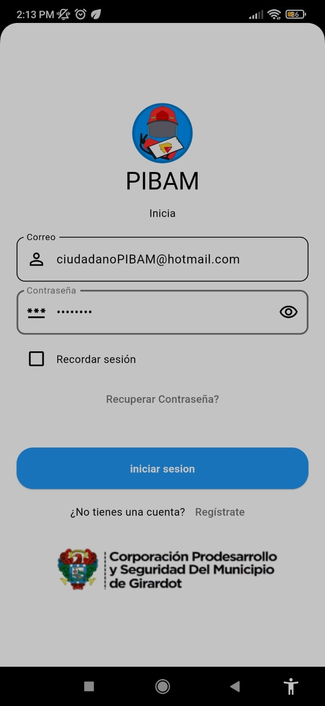

### PIBAM - PLATAFORMA INTELIGENTE DE BOMBEROS ALERTA MUNICIPAL

## Descripción
Este proyecto universitario tiene como objetivo desarrollar un sistema integral que permita a los ciudadanos de un municipio reportar amenazas de forma eficiente a través de una aplicación móvil y web. El sistema estará conectado con la estación de bomberos local, facilitando una respuesta rápida y organizada ante emergencias.

---

## Características Principales

### Geolocalización en Tiempo Real
- Los usuarios pueden reportar amenazas indicando su ubicación exacta mediante coordenadas GPS.
- Permite identificar rápidamente las zonas de riesgo.

### Interacción Ciudadana
- Adjuntar imágenes, descripciones y seleccionar categorías como incendios, inundaciones o accidentes eléctricos.
- Funciones para compartir alertas con la comunidad cercana.

### Integración con los Bomberos
- Organización automática de las alertas por prioridad y tipo.
- Provisión de datos cruciales como ubicación, descripción y recursos necesarios.
- Seguimiento del estado de las emergencias: recibido, en proceso, resuelto.

### Mapa de Riesgos
- Panel visual que muestra las zonas con mayor incidencia, útil para la planificación de estrategias de prevención.

### Notificaciones Automáticas
- Envío de alertas inmediatas a los ciudadanos y bomberos sobre nuevas amenazas cercanas.

### Análisis de Datos
- Generación de informes sobre emergencias atendidas.
- Estadísticas útiles para la toma de decisiones municipales.

---

## Impacto Esperado
Este sistema fomenta la colaboración entre ciudadanos y servicios de emergencia, mejorando la eficacia en la respuesta ante situaciones de riesgo. También proporciona a las autoridades municipales una herramienta valiosa para identificar patrones y prevenir futuros desastres.

---

## Tecnologías Utilizadas

### Frontend
- **Flutter**: Para aplicaciones móviles y web.

### Backend
- **POCKETBASE** Y **GO**: Gestión de datos y autenticación.

### Base de Datos
- **PocketBase**: Almacenamiento en tiempo real.

### Geolocalización
- Integración con **Google Maps** o **MAPBOX**.

---

## Beneficiarios

### Ciudadanos del Municipio
- Mayor seguridad y facilidad para reportar amenazas.

### Estación de Bomberos
- Herramienta de coordinación y monitoreo.

### Autoridades Municipales
- Mejora en la gestión de recursos y toma de decisiones basada en datos.

---

## Ejemplos Visuales

### Login

### Menú Administrador PIBAM

### Generar Punto de Emergencia

### Emergencias

### Mapas Históricos

---

## Licencia
Este proyecto está licenciado bajo la BSD-2-Clause license
